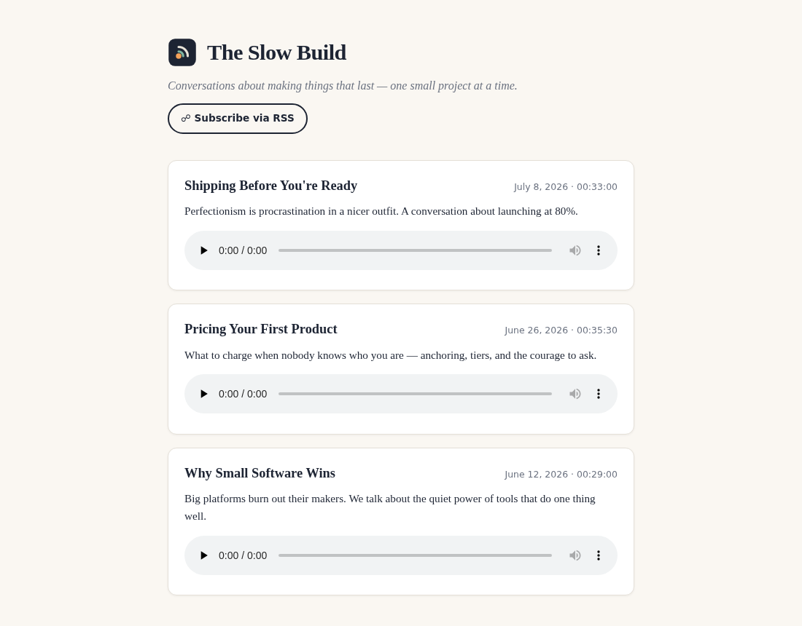

<p align="center"></p>

# feedloom

**Turn a folder of MP3s into a self-hosted podcast.** One command gives you a valid RSS feed and a clean landing page you can upload to any static host — no hosting fees, no middleman, your feed stays yours.



## Who it's for

Indie podcasters, newsletter writers adding audio, coaches and educators publishing lessons — anyone who wants their show on Apple Podcasts, Spotify, and every RSS app without paying $10–20/month for a hosting platform. If you can upload files to Netlify, GitHub Pages, or an S3 bucket, you can host your own show.

## Quick start

```bash
git clone https://github.com/brod-dev/feedloom.git
cd feedloom && npm link     # or: node bin/feedloom.js <command>

mkdir my-show && cd my-show
feedloom init               # creates podcast.json + episodes/
# drop your .mp3 files into episodes/, edit podcast.json
feedloom build              # writes public/feed.xml + public/index.html
```

Upload `public/` anywhere static files live, then submit `feed.xml` to podcast directories. Done.

## Episode metadata

Filenames become titles automatically (`02-pricing-your-first-product.mp3` → "Pricing Your First Product"). For full control, add a sidecar JSON next to any MP3:

```json
{
  "title": "Pricing Your First Product",
  "description": "What to charge when nobody knows who you are.",
  "date": "2026-06-26",
  "duration": 2130
}
```

## Features

- Valid RSS 2.0 with iTunes podcast tags (`itunes:author`, `itunes:duration`, `itunes:image`, enclosures with byte lengths) — accepted by Apple Podcasts and Spotify
- Polished, responsive landing page with inline audio players, episode dates, and an empty state
- Sidecar JSON metadata, or sensible defaults straight from filenames and file dates
- Zero dependencies — plain Node 18+, nothing to install or audit
- One folder in, one folder out; works with any static host or CDN

## Development

```bash
npm test    # unit tests via node:test
```

MIT licensed.
